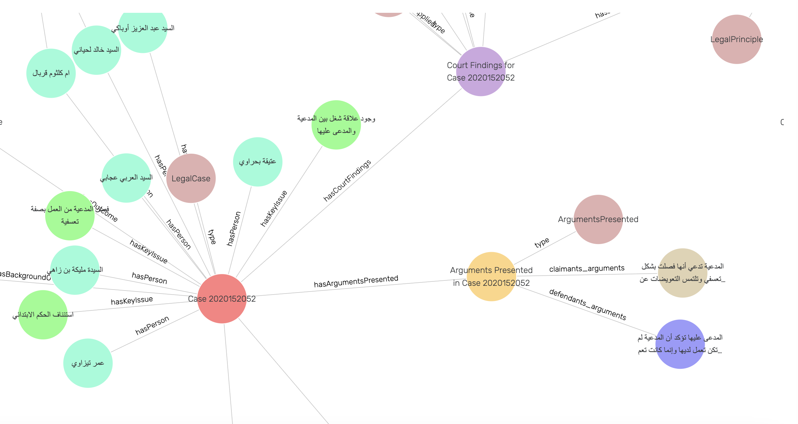

# Knowledge Graph Creation

This part transforms structured legal case data into a comprehensive knowledge graph using RDF (Resource Description Framework) and provides SPARQL querying capabilities.

## 📋 Table of Contents
- [Overview](#-overview)
- [Prerequisites](#-prerequisites)
- [Installation](#-installation)
- [Data Pipeline](#-data-pipeline)
- [Usage](#-usage)
- [Ontology Structure](#-ontology-structure)
- [Query Capabilities](#-query-capabilities)
- [Visualization](#-visualization)
- [Created Knowledge Graph](#-created-knowledge-graph)

## 🔍 Overview

The knowledge graph creation module converts JSON-structured legal case data into a rich, interconnected graph database. It enables complex queries and analysis of legal cases based on various properties including case topics, legal principles, involved parties, and court decisions.

[Here](https://drive.google.com/u/0/drive-viewer/AKGpihbMcHOWn08K64YhZEGnNEUqMQLfF8hX-0T1Fd0hFfnzxozo7wLtrmVsfjB_8CS3qrFY_eM6UHhczDDOetfd4swaBveB3FCwgw=s1600-rw-v1) is a demonstration of the created knowledge graph, showcasing its structure, capabilities, and potential applications in legal research and analysis.

### Key Features:
- Custom legal domain ontology
- RDF conversion pipeline
- SPARQL query support
- GraphDB integration
- Entity relationship visualization

## 💻 Prerequisites

- Python 3.10+
- GraphDB instance
- Additional Python packages listed in requirements.txt

## 🚀 Installation

1. Install the required Python packages:
```bash
pip install -r requirements.txt
```


## 📊 Data Pipeline

The knowledge graph creation process involves several steps:

1. **Ontology Development**
   - Custom ontology reflecting legal domain concepts
   - Properties aligned with JSON template structure
   - Hierarchical relationship definitions

2. **RDF Conversion**
   - JSON to RDF transformation
   - Entity creation and linking
   - Property mapping
   - Date normalization
   - Error handling and logging

3. **Graph Database Population**
   - RDF data loading into GraphDB
   - Relationship establishment
   - Index creation for efficient querying

## 🔧 Usage

1. The ontology file is already created and located in  (`../data/legal_case_ontology.ttl`)

2. Run the graph creation script:
```bash
python create_graph.py
python create_graph.py --folder /../data/json_files --output /../data/output.ttl --ontology /../data/legal_case_ontology.ttl --log /../logs/graph_creation.log

```

This will:
- Process all JSON files in the input directory
- Convert them to RDF format
- Generate a combined Turtle (.ttl) file
- Log any conversion errors

## 🌳 Ontology Structure

The ontology includes the following main components:

- **Case Information**
  - Case number
  - Date of ruling
  - Court details
  - Main case topic
  - Outcome

- **Persons Involved**
  - Names
  - Roles
  - Relationships

- **Legal Concepts**
  - Legal principles
  - Arguments
  - Court findings
  - Key Issues

- **Temporal Information**
  - Event dates
  - Ruling dates
  - Case timeline

## 🔍 Query Capabilities

The knowledge graph supports various SPARQL queries, including:

1. **Court-specific Queries**
```sparql
PREFIX legal: <http://example.org/legalcase#>
SELECT ?case WHERE {
  ?case legal:court entity:Court_X .
}
```

2. **Legal Principle Analysis**
```sparql
PREFIX legal: <http://example.org/legalcase#>
SELECT ?case ?principle WHERE {
  ?case legal:hasCourtFindings/legal:hasLegalPrincipleApplied ?principle .
}
```

3. **Temporal Analysis**
```sparql
PREFIX legal: <http://example.org/legalcase#>
SELECT ?case ?date WHERE {
  ?case legal:hasCaseInformation/legal:dateOfRuling ?date .
} ORDER BY ?date
```


## 🛠️ Error Handling

The module includes comprehensive error handling:
- Detailed error logging
- Date parsing validation
- URI sanitization
- Graph triple validation

## 📊 Visualization

The knowledge graph can be visualized using:
- GraphDB's built-in visualization tools
- Custom visualization scripts
- Third-party graph visualization libraries

## 🌐 Created Knowledge Graph

Below is a sample of the created knowledge graph:



